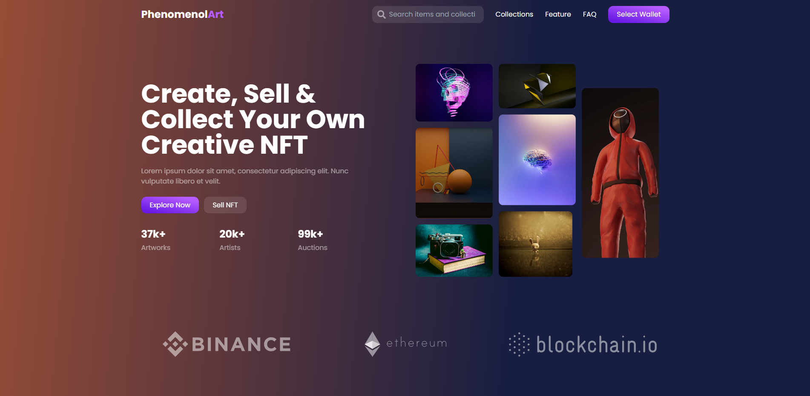

  
  
  

 
✨ [Live Demo](https://phenomenol-art.vercel.app)
  
    
  </a>

## Built With

* [Next JS](https://nextjs.org/)
* [Tailwindcss](https://tailwindcss.com/)

<!-- CONTACT -->
## Contact

anis.khalef98@gmail.com

